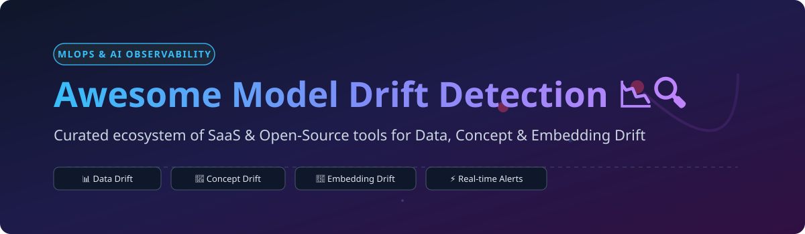

# 📉 Awesome Model Drift Detection 🔍

## 🚀 Top Model Drift Detection Ecosystem

**A Curated List of Production SaaS Platforms & Open-Source GitHub Repositories for Machine Learning Drift Detection, Data Drift Monitoring, and AI Observability.** 

> 🎯 **Focus Areas**: *Data Drift, Concept Drift, Prediction Drift, Embedding Distribution Shifts, Feature Distribution Monitoring, Covariate Shift & Production Model Performance Decay.*

📅 **Last updated**: September 2026

---

## 📌 Overview & Introduction

In machine learning operations (MLOps), **model drift** represents the degradation of a predictive model's performance over time due to changing real-world data and environments. This repository tracks notable **SaaS platforms** and **open-source tools** engineered to continuously compare production data distributions against baseline references. 

Detecting data drift, concept drift, and embedding shifts early enables timely automated alerts, root-cause investigation, continuous validation, and triggered model retraining pipelines.

---

## 📑 Table of Contents

- [📊 Market Overview & Market Size](#-market-overview--market-size)
- [🏢 SaaS & Managed Hosted Platforms](#-saas--managed-hosted-platforms)
- [💻 Open-Source GitHub Repositories](#-open-source-github-repositories)
- [⚙️ Open-Source Ecosystem & Companion Tooling](#%EF%B8%8F-open-source-ecosystem--companion-tooling)
- [🤝 How to Contribute](#-how-to-contribute)
- [❤️ Support & Sponsorship](#%EF%B8%8F-support--sponsorship)
- [📈 Star History](#-star-history)
- [⚠️ Disclaimer](#%EF%B8%8F-disclaimer)

---

## 📊 Market Overview & Market Size

> 💡 **Market Insight**: The global **AI Observability & Model Monitoring Market** is estimated at **$1.8 Billion - $2.4 Billion (2026)** and is projected to expand at a CAGR of **~28-34%** through 2030, driven by widespread enterprise LLM and ML deployment.
> 
> 🧩 **Market Structure**: The sector is **moderately fragmented**, featuring high-growth specialized AI observability scale-ups (Arize AI, Fiddler AI, WhyLabs, Galileo) alongside enterprise cloud platform features (AWS SageMaker Model Monitor, Azure ML, Databricks). While top pure-play observability platforms lead technical innovation, no single vendor maintains a winner-take-all monopoly, leaving substantial room for modular open-source solutions (Evidently, Deepchecks, Alibi Detect).

---

## 🏢 SaaS & Managed Hosted Platforms

The following table summarizes enterprise SaaS platforms specializing in continuous model monitoring, root-cause analysis, feature drift detection, and production ML/LLM observability.

| 🏢 Platform | 📝 Key Focus & Description | 💰 Starting Paid Price | 🎁 Free Tier / Free Trial Limit | 📊 Size (Est. Valuation / Funding) |
| :--- | :--- | :--- | :--- | :--- |
| **[Arize AI](https://arize.com/)** | Enterprise ML & LLM observability platform with feature drift, embedding drift visualization, and automated root-cause analysis. | $500/month (Pro Plan) | **Free Tier**: Up to 2 model monitors & 50K model inferences/month free forever. | **~$250M - $400M** (Series B, $61M raised) |
| **[Galileo](https://www.rungalileo.io/)** | Enterprise evaluation and observability platform for LLMs, RAG applications, and fine-tuned embeddings drift. | $450/month (Team Plan) | **Free Trial**: 14-day free trial with 10,000 evaluation credits. | **~$150M - $250M** (Series B, $68M raised) |
| **[Fiddler AI](https://www.fiddler.ai/)** | Enterprise MLOps platform combining drift monitoring, explainability (SHAP), and model governance for regulated sectors. | $500/month (Developer Tier) | **Free Trial**: 14-day free trial with up to 5 production models. | **~$200M - $300M** (Series B, $47M raised) |
| **[Evidently Cloud](https://www.evidentlyai.com/)** | Managed SaaS platform built on the Evidently framework offering cloud dashboards, managed drift reports, and alerting. | $49/month (Starter Plan) | **Free Tier**: Free forever for up to 1 user and 3 monitoring projects / 100K data points. | **~$20M - $50M** (Seed / Early Stage, $3M+ raised) |
| **[WhyLabs](https://whylabs.ai/)** | Privacy-preserving AI observability using statistical profiles (`whylogs`) for scalable data drift detection. | $99/month (Pro Tier) | **Free Tier**: Starter plan free forever for up to 2 models and 10M events/month. | **~$50M - $100M** (Series A, $14M raised) |
| **[Aporia](https://www.aporia.com/)** | Full-stack AI observability platform featuring real-time data drift alerts, custom metrics, and guardrails. | $600/month (Growth Tier) | **Free Trial**: 14-day full feature free trial for up to 3 models. | **~$100M - $180M** (Series A, $25M raised) |
| **[Arthur AI](https://www.arthur.ai/)** | Model monitoring platform tracking accuracy decay, feature distribution shifts, bias, and performance drop. | $750/month (Standard Plan) | **Free Trial**: 30-day interactive sandbox and free trial for 1 model. | **~$100M - $200M** (Series B, $60M raised) |
| **[Superwise](https://www.superwise.ai/)** | Fully automated ML monitoring platform detecting drift, data quality anomalies, and performance metrics. | $300/month (Scale Plan) | **Free Tier**: Free Community Edition for up to 3 active models. | **~$20M - $50M** (Seed / Series A, $14.5M raised) |
| **[Deepchecks Cloud](https://www.deepchecks.com/)** | Continuous continuous validation and monitoring SaaS platform for tabular, NLP, and LLM applications. | $250/month (Team Plan) | **Free Tier**: Free forever account for up to 1 model and 50K predictions/month. | **~$40M - $80M** (Seed / Series A, $14M raised) |

---

## 💻 Open-Source GitHub Repositories

The open-source ecosystem provides powerful statistical libraries, profiling frameworks, and self-hosted drift detection engines.

*(Sorted by GitHub Stars_Count in descending order)*

- **[Evidently](https://github.com/evidentlyai/evidently)**   
  🏆 **Most popular open-source ML & LLM observability framework**. Provides 100+ built-in metrics, test suites, and interactive HTML dashboards for statistical data drift (KS-test, PSI, Wasserstein distance), prediction drift, and target drift.

- **[Alibi Detect](https://github.com/SeldonIO/alibi-detect)**   
  🛡️ **Algorithms for outlier, adversarial, and drift detection**. Developed by Seldon, Alibi Detect provides statistical online and offline detectors (MMD, Kolmogorov-Smirnov, Chi-Square, Learned Kernel Drift) across tabular, text, and computer vision data.

- **[Deepchecks](https://github.com/deepchecks/deepchecks)**   
  ✅ **Comprehensive suite for AI & ML validation and monitoring**. Features intuitive checks for data integrity, covariate shift, data drift, and performance decay across tabular, NLP, and CV domain datasets.

- **[whylogs](https://github.com/whylabs/whylogs)**   
  ⚡ **Open standard for data profiling and statistical sketches**. Enables high-throughput, low-overhead, privacy-preserving data profiling and drift comparison without transferring raw data payload.

- **[Great Expectations](https://github.com/great-expectations/great_expectations)**   
  🧹 **Data quality and data pipeline validation framework**. Widely deployed in MLOps pipelines to test statistical distributions, feature freshness, schema assertions, and upstream data drift before model inference.

- **[NannyML](https://github.com/NannyML/nannyml)**   
  🔮 **Post-deployment performance estimation and multivariate drift detection**. Specializes in estimating model performance (e.g., ROC-AUC, F1-score) when ground truth labels are delayed or absent, utilizing Confidence-Based Performance Estimation (CBPE).

- **[River](https://github.com/online-ml/river)**   
  🌊 **Go-to Python library for online machine learning and streaming concept drift detection**. Features lightweight streaming drift detectors such as ADWIN, DDM, EDDM, Page-Hinkley, and HDDM.

- **[Popmon](https://github.com/ing-bank/popmon)**   
  📈 **Population statistics and monitoring package by ING Bank**. Computes stability metrics and statistical test comparisons over time-series dataset profiles to highlight significant distribution shifts.

- **[Menelaus](https://github.com/KDD-Open-Source/menelaus)**   
  🔬 **Python package working with stream and batch concept drift detection**. Implements classic and academic algorithms (LADDER, STEPD, MDDM, CD-GWM) designed specifically for streaming and dynamic environments.

- **[drift-detection-benchmarks](https://github.com/drift-detection-benchmarks/drift-benchmark)**   
  🧪 **Benchmarking suite for comparing data and concept drift detection algorithms** across standard datasets under controlled distribution shifts.

---

## ⚙️ Open-Source Ecosystem & Companion Tooling

When engineering a custom production monitoring stack, teams often combine these open-source tools:

* 📊 **Evidently Reports & Test Suites**: Declarative data drift and model stability tests integrated directly into CI/CD pipelines (GitHub Actions, Airflow, Kubeflow).
* 🔍 **Deepchecks Suites**: Pre-deployment validation checks detecting distribution mismatches between training, validation, and production splits.
* ⚡ **Whylogs Profiling**: Ultra-lightweight data profiling embedded in streaming spark/flink or REST serving containers to avoid shipping PII raw data.
* 🛡️ **Alibi Detect**: Complex multivariate and embedding space drift algorithms (Maximum Mean Discrepancy, Adversarial Detectors).
* 🔮 **NannyML**: Performance estimation for real-world scenarios where true target labels take weeks or months to arrive.

---

## 🤝 How to Contribute

Contributions, new tools, and updates are very welcome! 🚀

1. 🍴 **Fork** the repository.
2. 📝 Add or edit entries in `README.md` keeping formatting clean and factual.
3. 🔗 Include tool name, official homepage or GitHub repo link, and a concise 1-2 sentence description.
4. 📬 Submit a **Pull Request** with a clear title.

---

## ❤️ Support & Sponsorship

If you find this curated list helpful for your MLOps workflow, please consider supporting the project:

* ⭐ **Star this repository** on GitHub to help others discover it!
* 🔀 **Fork & Share** with your MLOps and Data Science network.
* ☕ **Buy me a coffee / Sponsor**: If you'd like to support ongoing maintenance and research, you can sponsor via the [GitHub Sponsor Dashboard](https://github.com/sponsors/ishandutta2007).

---

## 📈 Star History

---

## ⚠️ Disclaimer

* This repository is a **community-curated list** provided for educational and informational purposes.
* Mention of commercial SaaS products or open-source projects does not imply official endorsement or warranty.
* Statistical tests and drift detection thresholds must be calibrated carefully based on domain specifics, sample sizes, and business constraints to prevent alert fatigue.

---

<b>Made with ❤️ for ML Engineers, MLOps Practitioners, Data Scientists, and AI Observability Teams.</b>

